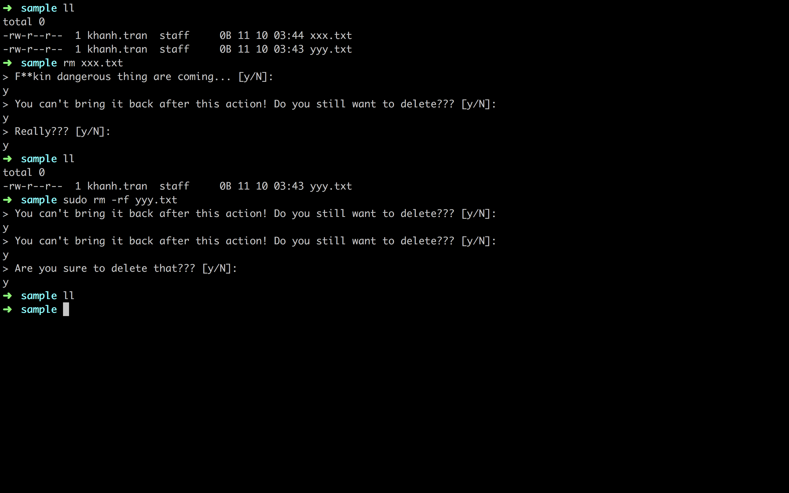

# SFRM

__SFRM__ (safe rm) is a preprocessor that checks every command you type on terminal and makes sure that you can not delete anything with the `rm` command easily.

## Usage



## Requirement

__preexec__ - a default feature of `zsh` ( and `ksh` ) shell to do something you specify before every command you typed run. More about `preexe` go [here](https://docstore.mik.ua/orelly/unix3/upt/ch04_16.htm).

## Install

```$xslt
# Pull down our file from GitHub and write it to our home directory as a hidden file.
curl https://raw.githubusercontent.com/khanhtc1202/sfrm/master/sfrm_zsh.sh -o ~/.sfrm_zsh.sh
# Add its source to the tail of shell config
cat ~/.sfrm_zsh.sh >> ~/.zshrc
source ~/.zshrc
```

## Optional

The number of printout questions can be set by `$SFRM_MAX` env. By default three questions will be printout.

## TODO

Supported shell(s)
- [x] zsh
- [ ] bash
